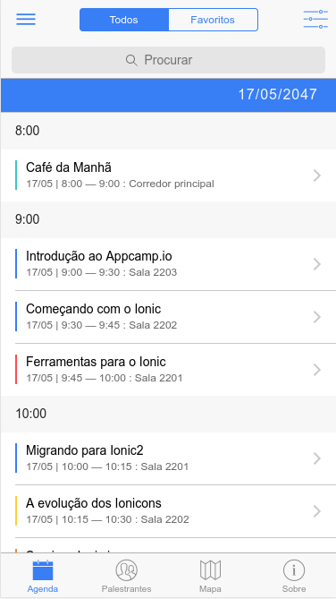
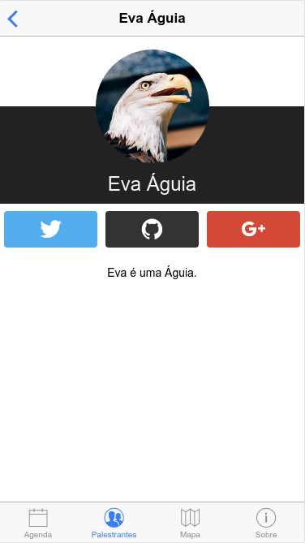

# Ionic 2 Conference Application

This version has been modified and freely translated pt-BR by me - [Guga Zimmermann](https://github.com/allprefsistemas/)

Original: [Ionic 2 Conference Application](https://github.com/driftyco/ionic-conference-app/)

## Significant changes implemented
- Change in CSS to make a little more attractive.
- check user login to see if are already logged in and shows the schedule, otherwise requires the user to login or register.
- Schedule supports more than 1 day.
- Items of the Schedule and Speakers indexed by ID.
- If an item are already in favorites, show Remove button.
- Reshaping the details page of events and speakers.

## Changes in development
- Example of login with Facebook and Google+
- Remote database use (in the server).
- Map with route between the user's location and location of the event.

***

# Ionic 2 Aplicativo Conferência

Uma demonstração do Ionic 2 modificada e traduzida livremente para pt-BR por mim - [Guga Zimmermann](https://github.com/allprefsistemas/)

Original: [Ionic 2 Conference Application](https://github.com/driftyco/ionic-conference-app/)

## Principais mudanças realizadas
- Mudança nos CSS para deixar um pouco mais atraente.
- Verificação do login do usuário, se já estiver login mostra a agenda, senão obriga o usuário a entrar ou fazer cadastro.
- Agenda aceita mais de 1 dia.
- Itens da Agenda e Palestrantes indexados por ID.
- Se um item já estiver no favoritos, mostrar botão Remover.
- Remodelagem na página de detalhes dos eventos e dos palestrantes.

## Mudanças em desenvolvimento
- Exemplo de login pelo Facebook e Google+
- Utilização de banco de dados remoto (no servidor).
- Mapa com rota entre a localização do usuário e localização do evento.

## Importante!
**Não existe uma Conferência do Ionic de verdade atualmente.** 

Este projeto é feito somente para mostrar os componentes do Ionic v2.0 em uma aplicação real.

Este projeto é somente uma demonstração e está em desenvolvimento.

## Utilizando

* Clone este repositório.
* Rode `npm install` na raiz do projeto.
* Instale o ionic CLI (`npm install -g ionic@beta`)
* Rode `ionic serve` no terminal na raiz do projeto.
* Aproveite

**Nota:** Está lento? Atualize o `npm` para 3.x: `npm install -g npm`.

## PARA MAIS INFORMAÇÕES ACESSE O PROJETO ORIGINAL

## App Preview

### Android

### iOS

